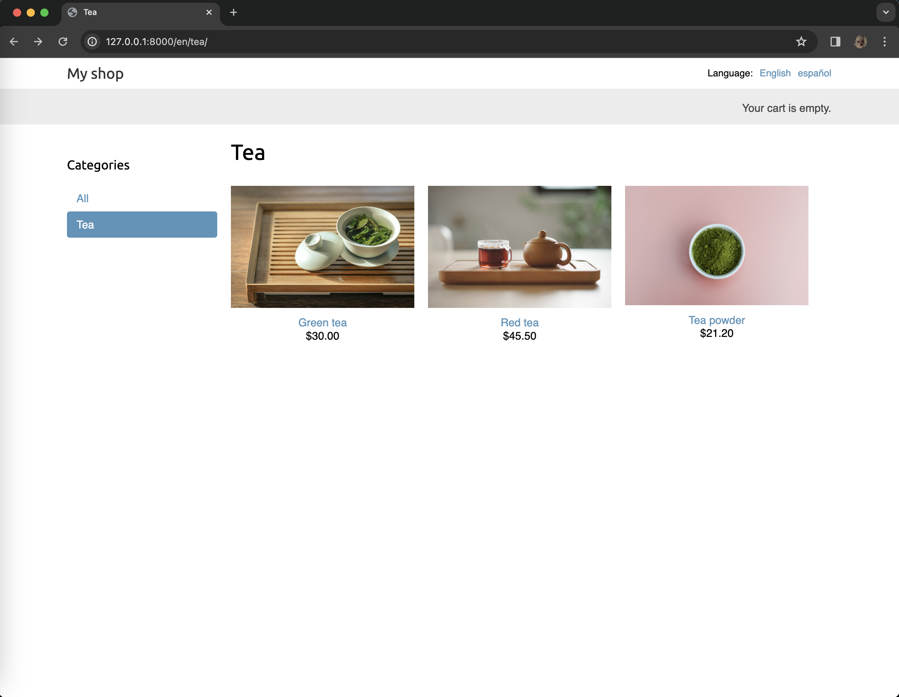
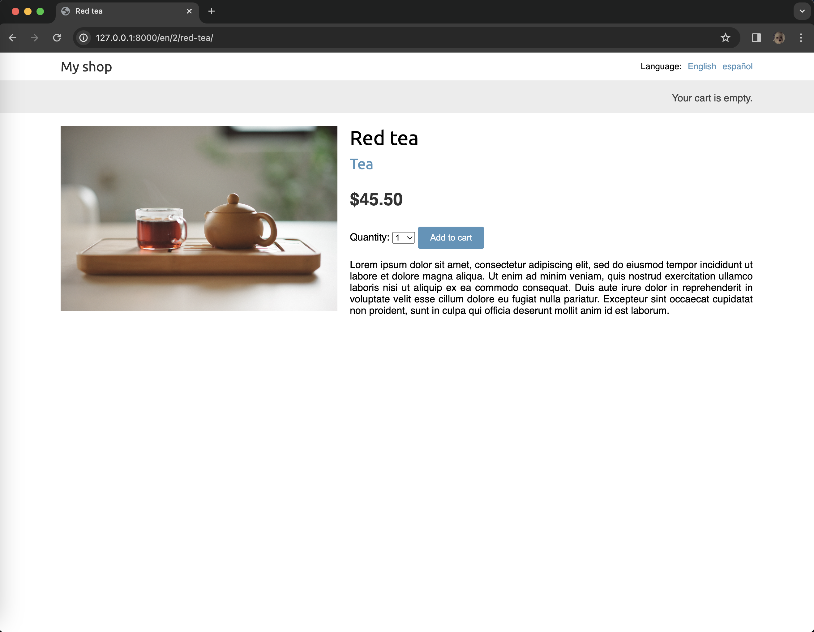
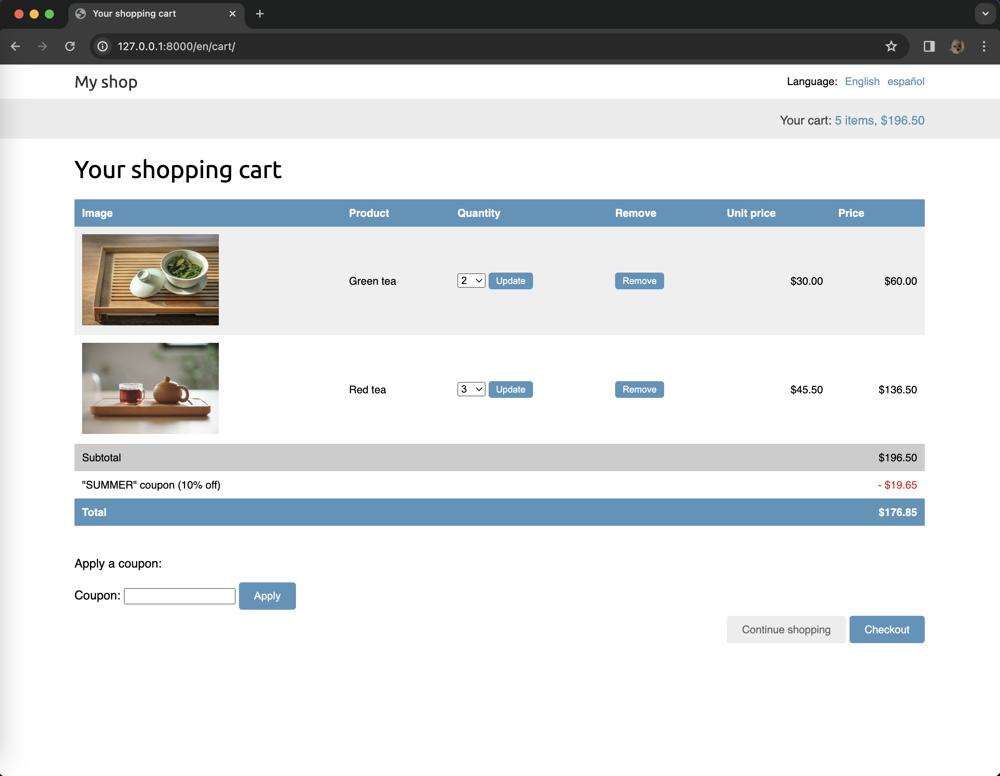
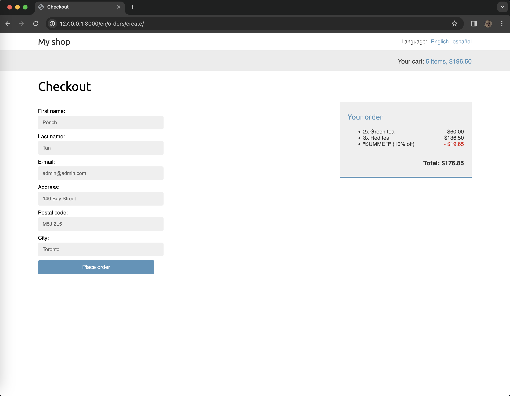
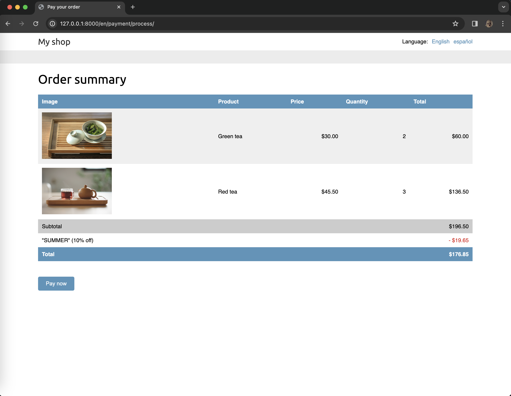
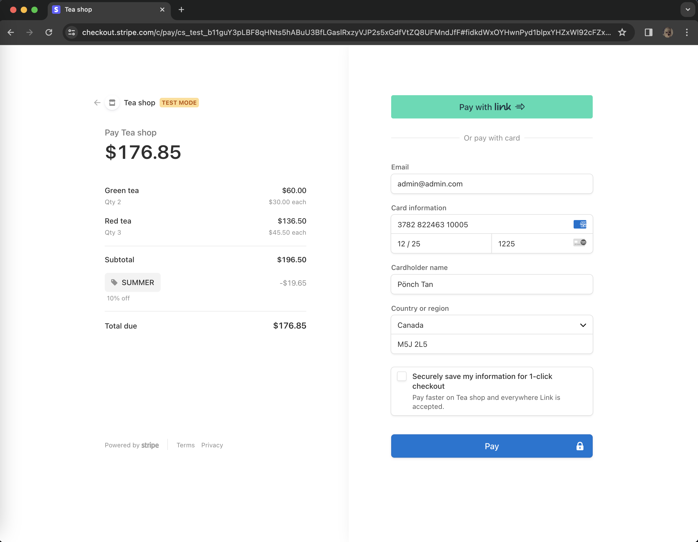
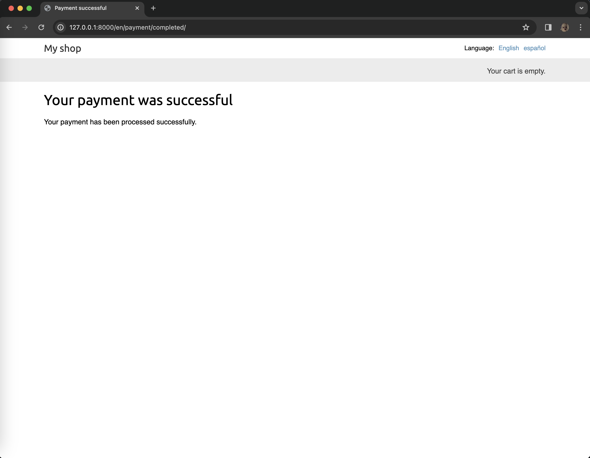
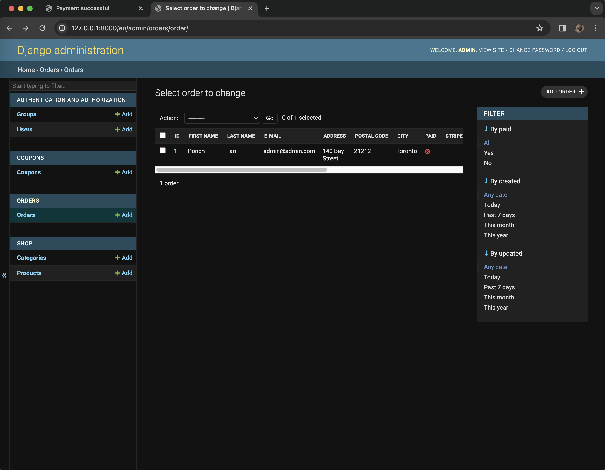
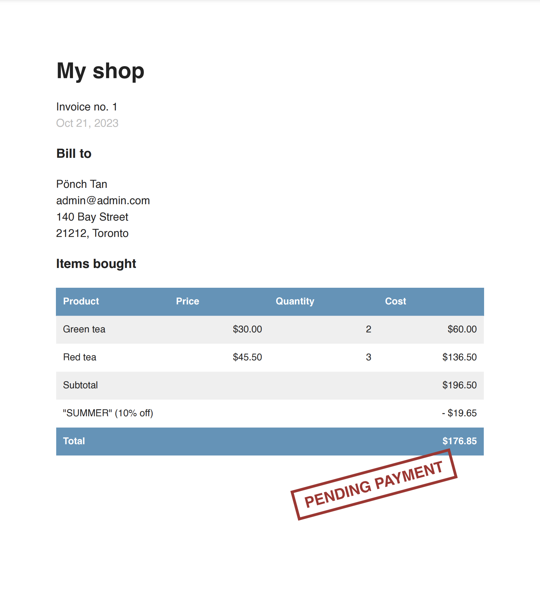

# myshop

This is the code repository for an ecommerce application utilizing the Django framework.

## Instructions

The code is organized into directories and it has a `requirements.txt` file that includes all packages required to run the application. These can be installed with the command `pip install -r requirements.txt`.

## About the Project

**myshop** serves as my deliberate practice while guiding me through the entire process of developing professional web applications with Django. This application not only covers the most relevant aspects of the framework, but it also shows how to integrate other popular technologies into a Django project.

The code walks through the creation of a real-world application, solving common problems, and implementing best practices, using a step-by-step approach that is easy to follow.

After completing this project, it has given me a good understanding of how Django works and how to build practical, advanced web applications.

## Requirements

This project requires Python 3.10+ and Django 4.1.

## Django Project

This exercise covers a wide range of web app development topics as specified below:

- **Ecommerce Application** : A fully featured online shop

  - Built the models of the product catalog
  - Created a shopping cart using Django sessions
  - Created custom context processors
  - Managed customer orders
  - Sent asynchronous notifications using [Celery](https://docs.celeryq.dev/) and [RabbitMQ](https://www.rabbitmq.com/)
  - Monitored Celery using [Flower](https://github.com/mher/flower)
  - Integrated [Stripe](https://stripe.com/) to process payments
  - Implemented a webhook to receive payment notifications from Stripe
  - Built custom views in the Django administration site
  - Created admin actions and generated CSV files
  - Generated PDF invoices dynamically using [Weasyprint](https://weasyprint.org/)
  - Created a coupon system to apply disconts to orders
  - Integrated discounts with Stripe payments
  - Built a product recommendation engine using Redis
  - Added internationalization to the shop
  - Generated and manage translation files
  - Used [Rosetta](https://github.com/mbi/django-rosetta) to manage translations
  - Translated URL patterns and build a language selector
  - Translated models using [django-parler](https://github.com/django-parler/django-parler)
  - Localized forms using [django-localflavor](https://github.com/django/django-localflavor)

#### product list page

#### product detail page

#### cart detail page

#### checkout_page

#### order summary page

#### stripe checkout payment form

#### success_page

#### orders admin page

#### pdf invoice

